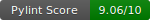

 


# Trend Getter
## A tool that allows users to select topics/tags on key sites (Google Trends, BlueSky) and monitor their growth/interest over time.

<details>
  <summary>Table of Contents 📝</summary>
  <ol>
    <li>
      <a href="#about-the-project-">About The Project</a>
      <ul>
        <li><a href="#diagrams-">Diagrams</a></li>
        <li><a href="#built-with">Built With</a></li>
      </ul>
    </li>
    <li>
      <a href="getting-started">Getting Started</a>
      <ul>
        <li><a href="#prerequisites">Prerequisites</a></li>
        <li><a href="#installation">Installation</a></li>
      </ul>
    </li>
    <li>
      <a href="#requirements-">Requirements</a>
    </li>
    <li>
      <a href="#folders-explained-">Folders Explained</a>
    </li>
    <li>
      <a href="files-explained">Files Explained</a>
    </li>
    <li>
      <a href="#developers-">Developers</a>
    </li>
  </ol>
</details>

## About the Project


### Diagrams 📊

#### Architecture Diagram


#### ERD Diagram


### Built With
 [![Python][Python.com]][Python-url]


## Getting Started 🛠️

### Prerequisites:
- Python 3.12 must be installed with pip3 for dependency installation.  

### Installation:
These instructions are for **macOS only**.

1. **Clone the repository to your local machine using the following command**:
    ```sh
    git clone https://github.com/Kurt812/trend-getters-project.git
    ```
2. **Navigate into the cloned repository**.
3. **Setup venv environment**:
    ```zsh
    python3.12 -m venv .venv
    source .venv/bin/activate
    ```
4. **Install all required dependencies**:
    ```sh
    pip3 install -r requirements.txt
    ```
5. **Configure AWS CLI**:
    - Install AWS CLI if you don't have it already:
        ```sh
        brew install awscli
        ```
    - Configure your AWS credentials by running:
        ```sh
        aws configure
        ```
      You will be prompted to enter your AWS Access Key ID, Secret Access Key, region, and output format. Make sure to provide your AWS credentials when prompted.

7. **Login to AWS**:
    - Once configured, you can log in to AWS from your terminal using:
        ```sh
        aws sts get-caller-identity
        ```
      This will confirm that you are authenticated and have access to your AWS resources.

## Requirements 📋
Each directory has its own `.env` or secrets file. Please refer to the individual directory for the necessary secrets management.

   
## Folders Explained 📁
These folders are found this repository:    

- **[dashboard](https://github.com/Kurt812/trend-getters-project/tree/main/dashboard)** 
This directory contains all code relating to the dashboard that users can use to track and submit topics to monitor their trends.

- **[images](https://github.com/Kurt812/trend-getters-project/tree/main/images)**
This directory contains all the images found in this repository including the Entity Relationship Diagram (ERD) and the architecture diagram.

- **[notifications](https://github.com/Kurt812/trend-getters-project/tree/main/notifications)**
This directory contains all the code relating to collecting subscription data and sending notifications.

- **[notifications-pipeline](https://github.com/Kurt812/trend-getters-project/tree/main/notifications-pipeline)**
This directory contains all the code relating to updating the data for the keywords that are subscribed to before sending the notifications.
   
- **[pipeline](https://github.com/Kurt812/trend-getters-project/tree/main/pipeline)**
This directory implements a full Extract Transform Load (ETL) pipeline and contains the code needed to extract text related to user-defined keywords and topics, process and upload the data into an S3 and RDS instance.

- **[rds_to_s3](https://github.com/Kurt812/trend-getters-project/tree/main/rds_to_s3)**
This directory implements an Extract Transform Load pipeline to update the long term data in the S3 with the recent data in the RDS.

- **[terraform](https://github.com/Kurt812/trend-getters-project/tree/main/terraform)**  
This directory contains all the infrastructure-as-code (IaC) setup using Terraform. It includes the configuration files to provision and manage cloud resources, required for the Trend Getter project. These resources are essential for setting up the cloud environment that supports the ETL pipeline and real-time dashboard.
  
- **[upload](https://github.com/Kurt812/trend-getters-project/tree/main/upload)**
This directory contains scripts for extracting data from the BlueSky firehose, processing it, and uploading the results to an S3 bucket for storage. This functionality is contained within a Docker image created using the dockerfile within the directory.

## Files Explained🗂️
These files are found in this repository:
- **README.md**  
  This is the file you are currently reading, containing information about each file.   
- **requirements.txt**  
  This project requires specific Python libraries to run correctly. These dependencies are listed in this file and are needed to ensure your environment matches the project's environment requirements.


[Python.com]: https://img.shields.io/badge/python-3670A0?style=for-the-badge&logo=python&logoColor=ffdd54
[Python-url]: https://www.python.org/


## Developers 👨🏽‍💻👩🏽‍💻
This project was developed by the following contributors:

- **[Kurt Martin-Brown](https://github.com/Kurt812)** - Project Manager & Data Engineer
- **[Ridwan Hamid](https://github.com/RidwanHamid501)** - Architect & Data Engineer
- **[Keogh Jokhan](https://github.com/keoghrmj)** - Quality Assurance & Data Engineer
- **[Surina Santhokhy](https://github.com/SurinaCS)** - Quality Assurance & Data Engineer
